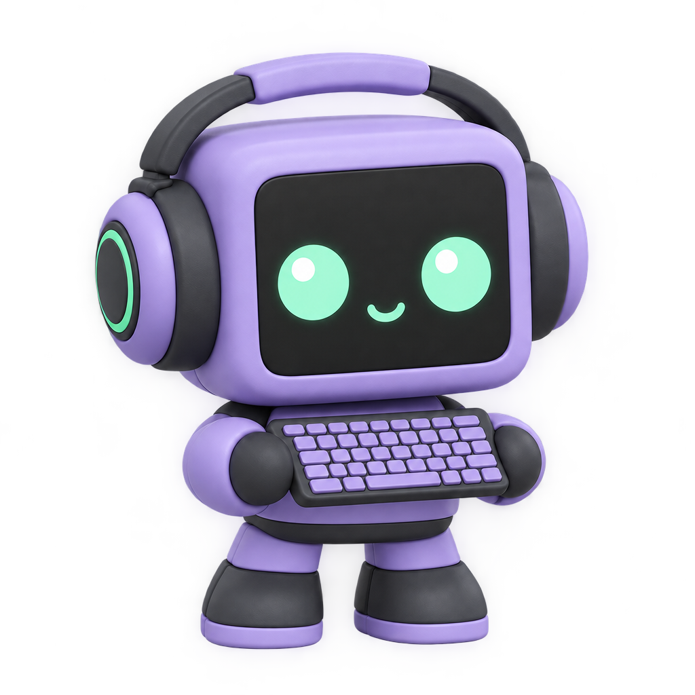
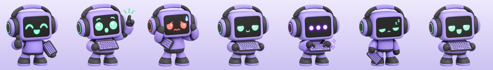
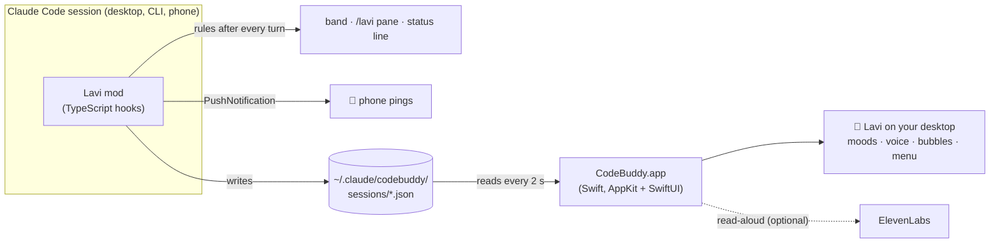

<div align="center">



# Lavi

**A little desktop robot who watches your Claude Code sessions and tells you, in plain words, what to do next.**

[](LICENSE)


</div>

---

When you build with an AI coding agent across lots of sessions, the small stuff slips: tests nobody ran, hours of work nobody committed, edits made straight on `main`, a context window that's almost full, a session that finished, or needs your OK, while you were away.

Lavi catches those moments. After every turn he checks your session against a set of plain rules (no model calls, no tokens), picks the single most useful next step, and hands you a **ready-to-send prompt** for it. Click it and it drops into your message box. You still press Enter.

He lives in three places:

- 🖥️ **On your desktop**: a floating robot whose face shows how your session is going. Hover for advice, click for everything else. He talks, too.
- 💬 **In every Claude Code session**: a band of one-click prompts above the message box, a `/lavi` pane, and a status line.
- 📱 **On your phone**: push pings when something is worth coming back for, through Claude Code's Remote Control.

## Contents

- [What Lavi notices](#what-lavi-notices)
- [One-click prompts](#one-click-prompts)
- [The desktop robot](#the-desktop-robot)
- [Phone pings](#phone-pings)
- [Install](#install)
- [Commands](#commands)
- [Configuration](#configuration)
- [Privacy and security](#privacy-and-security)
- [How it works](#how-it-works)
- [Development](#development)
- [Credits](#credits)
- [License](#license)

## What Lavi notices

Rules run after every turn, highest priority first. The top one becomes the advice; the rest are listed in the pane.

| Lavi says | When |
|---|---|
| tests are failing. let's fix those first. | the last test run failed |
| CI is red on PR #12. | this branch's PR has failing checks (via `gh`) |
| types or lint are broken. | the last `tsc` / `eslint` / `ruff` / `mypy`… run failed |
| PR #12 has changes requested. | a reviewer asked for changes |
| quick test run? | code was edited since the last test run |
| you're working straight on main. spin up a branch first. | uncommitted changes on the default branch |
| good time to save a checkpoint. commit what you've got. | more than 8 changed files, or no commit in 45+ min |
| main moved on. rebase before you push. | your branch is behind the default branch (as of your last fetch) |
| my memory's getting full (72%). let's write a quick handoff and start fresh. | the context window is 70%+ full |
| push your commits up. | commits that only exist on this Mac |
| nice, you're in a good spot. | none of the above |

Every piece of advice comes with the reason and the real numbers ("12 files changed and no commit in 50 min. a commit is your undo button."). Thresholds are tunable per repo; see [Configuration](#configuration).

**Ask Lavi** (`/lavi next` or the pane button) is the only part that uses the model. It asks your own session, reusing its cached context, for the single best next step, why, the risk to watch, and 2–3 prompts tailored to what you're doing.

## One-click prompts

Each piece of advice offers 2–3 prompts, for example *run all tests*, *just what changed*, *write tests*, *commit it*, *split commits*, *push + PR*.

- **In a session:** the band above the message box shows the advice and its prompts as buttons. Click one, or press ctrl+x tab, then `1`–`3`. The prompt **drops into your message box as a draft, and nothing is sent until you press Enter**. Anything you already typed stays; the prompt goes on a new line after it.
- **🛡 QA + security:** always on the band (`q`), in the pane, and as `/lavi qa`. It asks Claude to run the tests, typecheck and lint, hunt for real bugs, audit for security issues, fix what it finds without committing, and finish with a full severity-ranked report.
- **Draft handoff:** Lavi writes a session handoff (Done / Decisions / Next / Gotchas) and drops it in the box to review. It's worded for the author's SecondBrain notes vault; change `HANDOFF` in `mod/hooks/register.tsx` to match your own notes.
- **On the desktop robot**, prompts are copied to the clipboard, and the QA pass can open a new Claude session with the prompt already typed in.

## The desktop robot



| Mood | When |
|---|---|
| happy (bouncy thumbs up) | good spot, or celebrating |
| nudge (hand up) | there's a suggestion |
| worried (red face, nervous fidget) | tests or CI failing |
| calm (sways, nods, blinks) | nothing urgent |
| busy (`•••`, typing) | Claude is working |
| sleepy (zZ) | no session, or idle 30+ min |
| talking | mouth moves with his voice |

**His voice.** Lavi has 27 pre-recorded lines in a custom ElevenLabs voice. They play offline, with no API key and no cost per use. He speaks:

| When | Line |
|---|---|
| you click him | the current advice, or "all good" |
| advice changes | that advice's line |
| a 3+ min task finishes while you're at the Mac | "done with that big one" |
| tests go red → green, or you push | a celebration, with a hop |
| the Claude app opens, or a session starts | a greeting (the first one each day comes with a project check-in) |
| the Claude app quits | a goodbye |

**Morning check-in.** On the first greeting each day, Lavi sweeps your projects folder and shows which repos have uncommitted or unpushed work. Each one in his menu opens a new Claude session in that folder.

**He stays quiet** when muted, in quiet hours (10pm–8am by default), during calendar events (optional), while a Focus mode is on (automatic, see [Focus modes](#focus-modes)), in repos marked quiet, and never more often than every 20 seconds. Clicking him still works in quiet hours. Muting him (Settings → *Lavi talks*) silences everything.

**Read answers aloud (optional).** 🔊 *read it to me* under an Ask Lavi answer speaks it live in his voice through ElevenLabs. That takes your own API key and costs about 1 credit per character, capped at 600 characters per answer.

**Also:**
- **Speech bubbles:** cartoon callouts.
- **Five sizes:** Small (84pt) to XXL (240pt).
- **Settings window:** voice, quiet rules, size, shortcut, start at login, nudges, check-in folder, ElevenLabs key.
- **⌃⌥L** opens his menu from anywhere.
- **Stretch-break nudges:** off by default.
- **Menu:** sessions waiting on you, live and recent sessions (open in the Claude app, or resume in Terminal), and *Hide for 1 hour*.
- **Reduce Motion:** turns every animation off.

## Phone pings

Lavi uses Claude Code's own push notifications. They reach your phone when the session is connected to Remote Control, and are skipped while you're at the computer.

| Ping | When |
|---|---|
| long task finished | a turn ran 3+ min (says what's next) |
| something broke | tests failed during the turn, or it ended in an error |
| waiting on you | Claude asked you a question, or needs your OK to run something |
| gentle nudge | 30 min after a turn there's still uncommitted work (once per session) |

Pings are spaced at least 2 minutes apart, and anything that looks like a credential is masked first, since pings can show on a lock screen. Use `/lavi pings off` to stop them.

## Install

**Requirements**
- macOS 14 or later, with Xcode's command-line tools (`swiftc`)
- [Claude Code](https://claude.com/claude-code): the desktop app, the CLI, or both
- Python 3, for the installer's settings edit (preinstalled on macOS)
- Optional: [`gh`](https://cli.github.com/), logged in, for the CI and PR advice
- Optional: an ElevenLabs API key, for reading answers aloud

```bash
git clone https://github.com/chadkraus87/lavi.git
cd lavi
./install.sh
```

The installer:
1. builds `~/Applications/CodeBuddy.app` from source
2. installs a LaunchAgent so Lavi starts at login
3. adds the mod folder to `CLAUDE_CODE_PLUGIN_DIRS` in `~/.claude/settings.json`, keeping your existing entries. Your original settings are saved once as `settings.json.codebuddy-backup`, and the file is replaced atomically.

New Claude Code sessions load Lavi. Restart the Claude desktop app once so its sessions pick him up. To have desktop sessions reload mod changes without restarts, also set `"CLAUDE_CODE_PLUGIN_DIR_WATCH": "1"` in that same `env` block.

To uninstall, run `./install.sh --uninstall`. That removes the app, the LaunchAgent, the settings entry, and the ElevenLabs key from your Keychain.

> **Forking?** The app id `com.chadkraus.codebuddy` is used in `desktop/Info.plist`, the LaunchAgent, `install.sh` and the Keychain service name. Read-aloud uses the author's private ElevenLabs voice: set `laviVoiceID` in `desktop/Speech.swift` to a voice in your own account.

## Commands

| Command | Does |
|---|---|
| `/lavi` | open Lavi's pane: every step, its prompts, Ask Lavi, QA, handoff |
| `/lavi next` | Ask Lavi: the model's take plus tailored prompts |
| `/lavi qa` | put the full QA + security prompt in your message box |
| `/lavi handoff` | draft a session handoff into your message box |
| `/lavi doctor` | check every moving part and report what's working |
| `/lavi settings` | open the desktop Settings window |
| `/lavi pings on` · `off` · `test` | control phone pings |

`/buddy` works as an alias.

## Configuration

**Per repo:** add an optional `.lavi.json` at the repo root:

```json
{
  "quiet": true,
  "testCommand": "make check",
  "maxDirtyFiles": 15,
  "maxMinutesSinceCommit": 90,
  "contextWrapPercent": 80
}
```

| Key | Effect |
|---|---|
| `quiet` | no voice or pings for this repo (the advice still shows) |
| `testCommand` | used in the test prompts. It must be a plain command line (letters, digits, spaces, `./:@=+-_`, max 80 characters); anything else is ignored |
| `maxDirtyFiles` · `maxMinutesSinceCommit` · `contextWrapPercent` | thresholds for the commit and wrap-up advice; out-of-range values are ignored |

A `.lavi.json` arrives with whatever you clone, so Lavi treats it as untrusted and keeps only well-formed values.

**Desktop:** everything else lives in **Settings** (Lavi's menu → *Settings…*, `/lavi settings`, or `open ~/Applications/CodeBuddy.app --args --settings`).

### Focus modes

Focus quiet works with no setup. macOS records the active Focus in `~/Library/DoNotDisturb/DB/Assertions.json`, which only apps with Full Disk Access can read. Claude Code can, so the Lavi mod checks it every 30 seconds and relays it to the robot (a relay older than 2 min is ignored). Lavi never needs Full Disk Access himself.

**Scheduled Focus modes** may not show up in that file. If one doesn't silence Lavi, add a Shortcuts automation for it (Shortcuts → Automation → **+** → Focus):

- **When turning on** → *Run Shell Script*: `mkdir -p ~/.claude/codebuddy && touch ~/.claude/codebuddy/focus-on`
- **When turning off** → *Run Shell Script*: `rm -f ~/.claude/codebuddy/focus-on`

Settings has copy buttons for both commands.

## Privacy and security

- **What leaves your Mac:**
  - pings, through Claude Code's own push service
  - `gh` calls to GitHub for CI and review status, at most every 5 min
  - Ask Lavi, through your own Claude Code session
  - read-aloud text, sent to ElevenLabs, only when you press the button

  Nothing else.
- **What Lavi reads:** your session's git state, your own Claude transcripts' first lines (for the session menu), your calendar (counts and times only, when calendar quiet is on), and which Focus is on. All of it stays on your Mac.
- **What's stored:** small session files, your last read-aloud request and a status line, all in `~/.claude/codebuddy` (locked to your account, `0700`). Old session files are cleaned up after 7 days. Your ElevenLabs key is kept only in your login Keychain.
- **Hardening:**
  - session ids are validated before anything touches a shell or a link (desktop sessions open directly by their app id instead of being re-imported)
  - git runs with `core.fsmonitor=false`, because a repo's local config could otherwise make `git status` run a program
  - `.lavi.json` is sanitized
  - ping text is redacted
  - read-aloud is rate-limited to one request every 5 seconds
- **Found a security issue?** See [SECURITY.md](SECURITY.md).

## How it works



- **The brain** is a Claude Code mod: a function-hooks plugin in `mod/`. It watches tool calls (edits, test and lint runs, pushes) and turn boundaries, runs the rules, draws the band and pane, sends pings, and mirrors each session to a small JSON file.
- **The body** is a native macOS app in `desktop/`. It reads those files and handles everything visual and audible. The two halves share nothing but files, so either can be restarted alone.

```
mod/
  hooks/register.tsx    hooks: tool calls, turns, UI, commands, pings
  hooks/rules.ts        the advice rules, prompts, parsers (pure, tested)
  hooks/pings.ts        ping wording, spam guard, redaction (pure, tested)
  hooks/*.test.ts(x)    26 tests
desktop/
  main.swift            the robot: window, moods, bubbles, menu, voice triggers
  Settings.swift        SwiftUI settings window
  Speech.swift          ElevenLabs read-aloud + Keychain
  Quiet.swift           calendar and Focus quiet
  Projects.swift        morning check-in scan
  Hotkey.swift          ⌃⌥L
  art/  voice/          moods, idle frames, 27 voice lines (+ lines.json)
  tools/idle_frames.py  turns a chroma-key clip into aligned idle frames
install.sh
```

## Development

```bash
cd mod
claude plugin test .        # the mod's 26 tests
claude plugin validate .    # manifest + hooks check
cd .. && ./install.sh       # rebuild and reinstall the app
```

For editor types, run `/plugin-types mod/.claude-plugin/types` inside Claude Code, then `tsc -p mod`.

- **Change the advice:** edit `mod/hooks/rules.ts`. Each rule carries its text, reason, mood and prompts; the thresholds are constants at the top.
- **Add a voice line:** add it to `desktop/voice/lines.json`, generate it with your voice, save it as `voice-<id>.mp3`, then rerun `./install.sh`. Advice lines are named `advice-<rule id>`.
- **New idle animation:** run `desktop/tools/idle_frames.py CLIP KEY_HEX STILL OUT_PREFIX` on a short clip of Lavi over a flat key color. See `desktop/art/README.md`.

## Credits

- Built with [Claude Code](https://claude.com/claude-code).
- Character art: [Higgsfield](https://higgsfield.ai) (GPT Image 2.5 for the moods, Grok Video for the idle clips, keyed and aligned locally with ffmpeg and ImageMagick).
- Voice: designed and recorded with [ElevenLabs](https://elevenlabs.io).

## License

[MIT](LICENSE) © 2026 Chad Kraus
